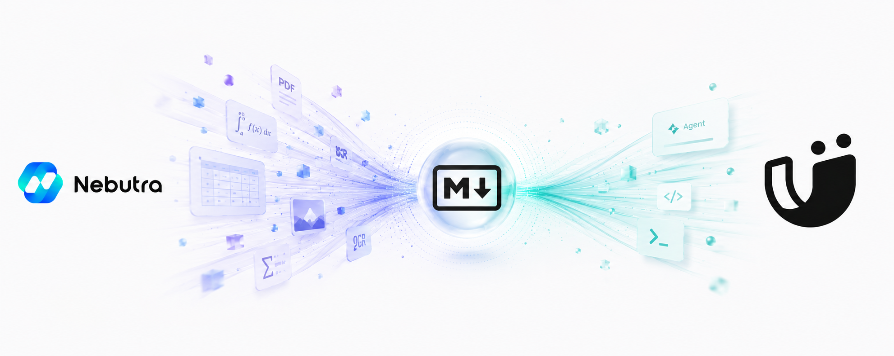

<p align="center">
  
</p>

# MinerU Skill

[](https://github.com/Nebutra/MinerU-Skill/releases) [](https://www.python.org/) [](requirements.txt) [](LICENSE) [](https://smithery.ai/skills/nebutra/mineru-skill)

[](https://github.com/Nebutra/MinerU-Skill/stargazers) [](https://github.com/Nebutra/MinerU-Skill/network/members)

**面向 AI Agent 的 AI 原生文档解析器** —— 零 API Key、零安装，把 PDF / Office / 图片解析成简洁 Markdown，并行批量、速度快。

**中文文档** | **[English](README.md)**

---

## ⚡ 5 秒上手（免注册、免 Token、免安装）

```bash
python3 scripts/mineru.py https://cdn-mineru.openxlab.org.cn/demo/example.pdf --stdout
```

就这一行。无需账号、无需 API Key、零依赖。免费的 **Agent 轻量解析 API** 会把
PDF 解析成干净的 Markdown，直接打到终端 —— 或者喂给你的 AI Agent。

> 想要更强？`export MINERU_TOKEN=...`，同一条命令会自动升级到 **精准解析 API**，
> 支持 200MB / 200 页大文件、并行批量、以及 DOCX/HTML/LaTeX 导出。

---

## 🤔 为什么不直接调 MinerU？

| | 裸调 MinerU API / 脚本 | **MinerU Skill** |
|---|---|---|
| **无 Token 即可开始** | ❌ 必须 Token | ✅ 免费 Agent API，零配置 |
| **后端选择** | 🤷 自己挑、自己接 | ✅ **自动路由** Agent ⇄ Standard |
| **安装体积** | `requests` + `aiohttp` | ✅ **零依赖**（纯标准库） |
| **Agent 友好输出** | 仅文件 | ✅ `--stdout` Markdown · `--json` 状态 |
| **格式模态** | 每种格式自己写 | ✅ PDF · 图片 · Word · PPT · Excel · HTML |
| **批量 + 续传** | 手搓 | ✅ 内置 `--workers` + `--resume` |
| **Token 报错** | 晦涩的 `code None` | ✅ 明确提示「Token 失效 → 这里刷新」 |
| **Obsidian 导出** | — | ✅ `--obsidian /vault/路径` |

为 **AI Agent 时代**而生：Agent 拿来即跑，Markdown 直接从 stdout 拿到，永远不用碰配置文件。

---

## 🚀 安装为 Skill（Claude Code、Codex、Cursor 等 35+ Agent）

### Smithery

[](https://smithery.ai/skills/nebutra/mineru-skill)

### OpenClaw

```bash
git clone https://github.com/Nebutra/MinerU-Skill.git ~/openclaw-skills/mineru/
# 开箱即用，无需 Token。可选：export MINERU_TOKEN=...  （https://mineru.net/apiManage/token）
```

### ClawHub

```bash
clawhub install mineru
```

### Claude Code / Cursor / Windsurf

```bash
git clone https://github.com/Nebutra/MinerU-Skill.git ~/.claude/skills/mineru/
```

---

## 💬 对你的 AI 说

```
你: 解析这些考研数学真题 PDF 到我的 Obsidian

AI: 📚 1 个输入 · workers=8 · token set
    ✅ [agent/pdf] 1993年考研数学（一）真题 (13.9s)
    ✅ [standard/pdf] 2024年考研数学（一）真题 (28.4s)   ← 自动升级（大文件）
    ...
    📁 已保存到 Obsidian/考研/数学一/
```

```
把 ./papers/ 下所有 PDF 并行解析，跳过已处理的，直接存到 Obsidian
```

---

## 🧩 支持的格式 —— PDF、Word、PPT、Excel、图片与 HTML

| 模态 | 扩展名 | OCR |
|------|--------|-----|
| 📄 PDF | `.pdf` | `--ocr` |
| 🖼️ 图片 | `.png .jpg .jpeg .jp2 .webp .gif .bmp` | 内置 |
| 📝 Word | `.doc .docx` | — |
| 📊 幻灯片 | `.ppt .pptx` | — |
| 📈 表格 | `.xls .xlsx` | — |
| 🌐 HTML | `.html`（精准解析，`MinerU-HTML`） | — |

完整保留 LaTeX 公式、结构化表格与提取的图片。

---

## 🛠️ 命令行使用

```bash
# 零配置：单文件或 URL
python3 scripts/mineru.py paper.pdf

# 把 Markdown 喂给 Agent / 拿到机器可读状态
python3 scripts/mineru.py paper.pdf --stdout
python3 scripts/mineru.py paper.pdf --json

# 并行批量目录、断点续传、直存 Obsidian
export MINERU_TOKEN=...
python3 scripts/mineru.py ./pdfs/ --output ./out/ --workers 8 --resume \
  --obsidian "~/Obsidian/MyVault/"

# 扫描件 OCR；额外导出格式（自动路由到精准解析 API）
python3 scripts/mineru.py scan.pdf --ocr --lang ch --format docx --format latex
```

| 参数 | 说明 |
|------|------|
| `INPUT...` | 文件、目录或 URL |
| `--output, -o` | 输出目录（默认 `./output`） |
| `--api` | `auto` · `agent` · `standard`（默认 `auto`） |
| `--model` | `pipeline` · `vlm` · `MinerU-HTML`（默认 `vlm`） |
| `--format` | `docx` · `html` · `latex`（可重复；强制精准解析 API） |
| `--ocr` / `--lang` | 开启 OCR / 指定语言（默认 `ch`） |
| `--pages` | 页码范围，如 `1-10` 或 `2,4-6` |
| `--workers, -w` | 并发数（默认 4） |
| `--resume` | 跳过已处理输入 |
| `--stdout` / `--json` | Markdown 打到 stdout / 机器状态打到 stdout |
| `--to SINK` | 投递到内容工具（可重复）—— 见下 |
| `--obsidian PATH` | `--to obsidian` 的快捷方式 |
| `--list-sinks` | 列出所有投递目标及所需环境变量 |

---

## 🔌 一键投递（`--to`）

解析一次，直接推进你的工具 —— 每个目标都走其**官方原生**接入方式（不瞎缝合）。可同时分发到多个：

```bash
python3 scripts/mineru.py paper.pdf --to obsidian --to notion --to slack
```

| | 工具 | `--to` |
|---|---|---|
| 📓 笔记（本地） | Obsidian · Logseq · 思源 SiYuan | `obsidian` `logseq` `siyuan` |
| 🌐 文档 / Wiki | Notion · Confluence · OneNote · Coda · 语雀 · 飞书 | `notion` `confluence` `onenote` `coda` `yuque` `feishu` |
| 💬 协作 / 任务 | Slack · 钉钉 · 企业微信 · 滴答清单 · Linear · Airtable | `slack` `dingtalk` `wecom` `ticktick` `linear` `airtable` |

凡有原生 Markdown 接入的目标（Obsidian、Logseq、思源、Linear、语雀、Coda、飞书、滴答）走原生路径；
需要转换的（Notion 块、Confluence/OneNote HTML）走忠实转换。每个目标的鉴权、保真度与图片处理说明，
以及 Roam / WPS 的坦诚 roadmap，详见 **[references/integrations.md](references/integrations.md)**。
运行 `python3 scripts/mineru.py --list-sinks` 查看所需环境变量。

---

## 📁 输出结构

```
output/
└── 文档名称/
    ├── 文档名称.md       # 简洁 Markdown
    └── images/           # 提取的图片（精准解析 API）
```

---

## 📊 性能（真实、无 mock 基准测试）

官方示例 PDF 经由**免费 Agent API** 的端到端耗时（提交 → 轮询 → 下载），
由 `tests/test_live.py` 实测：

| 运行 | 耗时 |
|------|------|
| 冷启动 | ~14 秒 |
| 热缓存 | ~13 秒 |
| p50 | ~14 秒 |

批量随 `--workers` 线性扩展。自己复现：

```bash
MINERU_LIVE=1 python3 -m pytest -m live -s
```

---

## 🔑 API Token（可选）

Agent API **无需 Token**。设置 Token 可解锁精准解析 API（大文件、批量、DOCX/HTML/LaTeX）：

1. 访问 **[MinerU Token 管理页](https://mineru.net/apiManage/token)**
2. 创建免费 Token
3. `export MINERU_TOKEN="你的-token"`

**免费额度：** 每天 1000 页最高优先级解析额度 · 单文件最大 200MB / 200 页。

> 📖 官方 API 文档：https://mineru.net/apiManage/docs

---

## 🧪 开发与测试

```bash
python3 -m pytest                            # 快速单元测试（离线，无网络）
MINERU_LIVE=1 python3 -m pytest -m live -s   # 真实 API + 基准测试（无 mock）
```

零运行时依赖 —— `scripts/mineru.py` 为纯标准库实现。

---

## ⭐ Star 趋势

<a href="https://www.star-history.com/#Nebutra/MinerU-Skill&type=timeline&legend=bottom-right">
 <picture>
   <source media="(prefers-color-scheme: dark)" srcset="https://api.star-history.com/svg?repos=Nebutra/MinerU-Skill&type=timeline&theme=dark&legend=bottom-right" />
   <source media="(prefers-color-scheme: light)" srcset="https://api.star-history.com/svg?repos=Nebutra/MinerU-Skill&type=timeline&legend=bottom-right" />
   
 </picture>
</a>

---

## 🏗️ 工作原理

```
你的文件 / URL
      │
      ▼
┌──────────────────────────────────────────────┐
│  mineru.py （零依赖、AI 原生）               │
│  识别模态 → 选择 API（自动）                 │
│     • 无 Token / 小文件 → Agent API          │
│     • Token + 大/批量    → 精准解析 API       │
│     • Agent 超限         → 自动升级            │
│  提交 → 轮询 → 下载 → 写出 Markdown          │
└──────────────────────────────────────────────┘
      │
      ▼
Markdown（含图片） → stdout · 文件 · Obsidian · JSON 状态
```

---

## 🤝 贡献指南

Fork → Branch → Commit → Push → PR。欢迎 Issue 与建议 —— 我们持续维护这个 Skill，
围绕 MinerU 生态为 AI Agent 不断打磨。

## 📝 许可证

MIT License - 详见 [LICENSE](LICENSE)

## 🙏 致谢

- [MinerU](https://mineru.net/) - PDF 解析引擎（[Token](https://mineru.net/apiManage/token) · [文档](https://mineru.net/apiManage/docs)）
- [OpenClaw](https://openclaw.ai/) - AI Skill 框架
- [ClawHub](https://clawhub.com) - Skill 市场

---

<div align="center">

**如果这个 Skill 帮你省了时间，给个 ⭐ —— 也能帮更多 Agent 发现它。**

Made with ❤️ by [Nebutra](https://github.com/Nebutra)

</div>
